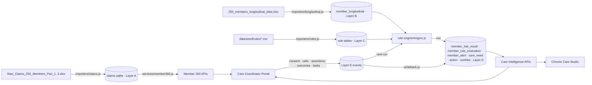

# Entity-relationship diagram

Generated by `node scripts/erd.js`. Keys only; full columns are in [DATA_MODEL.md](DATA_MODEL.md).

```mermaid
erDiagram
  member_policy {
    text mask_id PK
    text policy_id PK
    text e_policy_id
    text main_policy_group_id
    text e_mpg_id
    text policy_group_id
    text e_pg_id
    text package_id
  }
  member {
    text mask_id PK
    text principal_id
  }
  claim {
    text claim_id PK
    text mask_id
    text episode_id
    text audit_id
    text policy_id
    text provider_id
    text clinician_id
    text primary_diagnosis_id
  }
  provider {
    text provider_id PK
  }
  clinician {
    text clinician_id PK
  }
  diagnosis_code {
    text diagnosis_id PK
  }
  claim_activity {
    integer activity_row_id PK
    text claim_id
    text mask_id
    text activity_id
    text activity_detail_id
    text service_id
    text diagnosis_id
    text clinician_id
  }
  lab_observation {
    text observation_sk PK
    text activity_id
    text observation_id
    text observation_type_id
    text src_sys_id
    text mask_id
    text claim_id
  }
  member_identifier_crosswalk {
    text member_id PK
    text longitudinal_mask_id
    text claims_mask_id
  }
  member_longitudinal {
    text mask_id PK
  }
  rule_condition {
    text rule_id
  }
  rule_trigger {
    text trigger_code
    text class
  }
  rule_action {
    text trigger_code
  }
  rule_need_class {
    text class
  }
  risk_score_band {
    text rule_id
    text component
  }
  rule_risk_component {
    text component
  }
  rule_input {
    text field
  }
  longitudinal_field {
    text field PK
  }
  member_risk_result {
    integer run_id PK
    text member_id PK
  }
  intelligence_run {
    integer run_id PK
  }
  member_rule_evaluation {
    integer evaluation_id PK
    integer run_id
    text member_id
    text rule_id
  }
  rule_definition {
    text rule_id PK
  }
  member_alert {
    integer run_id PK
    text member_id PK
    text alert_rule_id
  }
  care_plan {
    text care_plan_id PK
    text member_id
    integer created_run_id
    integer updated_run_id
  }
  care_need {
    text need_id PK
    text care_plan_id
    text member_id
    text trigger_code
    integer opened_run_id
    integer last_evaluation_id
  }
  action {
    integer action_id PK
    text member_id
    text need_id
    integer parent_action_id
    integer run_id
  }
  nurse_user {
    text user_id PK
  }
  worklist {
    integer run_id PK
    text member_id PK
    text nurse_id
    text campaign_id
    integer action_id
  }
  cohort_rule {
    text rule_id PK
    text cohort_id
    text field
  }
  cohort {
    text cohort_id PK
  }
  cohort_member {
    text cohort_id PK
    text member_id PK
  }
  campaign_cohort {
    text campaign_id PK
    text cohort_id PK
    text role PK
  }
  campaign {
    text campaign_id PK
  }
  campaign_member {
    integer run_id PK
    text campaign_id
    text member_id PK
  }
  member_assignment {
    text member_id PK
    text nurse_id
  }
  contact_attempt {
    integer attempt_id PK
    text member_id
    text nurse_id
    integer action_id
    text campaign_id
  }
  call_interaction {
    integer call_id PK
    integer attempt_id
    text member_id
    text nurse_id
  }
  consent_event {
    integer consent_event_id PK
    text member_id
    integer call_id
    text nurse_id
  }
  member_assertion {
    integer assertion_id PK
    text member_id
    integer call_id
    text need_id
  }
  disposition_event {
    integer disposition_id PK
    text member_id
    text need_id
    integer action_id
    integer call_id
  }
  task {
    integer task_id PK
    integer action_id
    text member_id
  }
  appointment {
    integer appointment_id PK
    text member_id
    text need_id
    integer action_id
  }
  care_gap_event {
    integer gap_event_id PK
    text need_id
    text member_id
    integer run_id
  }
  member ||--o{ member_policy : "enrolled under"
  member ||--o{ claim : "belongs to"
  provider ||--o{ claim : "billed by"
  clinician ||--o{ claim : "seen by"
  diagnosis_code ||--o{ claim : "coded"
  claim ||--o{ claim_activity : "line of"
  member ||--o{ claim_activity : "for"
  claim_activity ||--o{ lab_observation : "observed on (ACTIVITY_ID)"
  claim ||--o{ lab_observation : "copied from activity"
  member_longitudinal ||--o{ member_identifier_crosswalk : "same person as"
  member ||--o{ member_identifier_crosswalk : "same person as (claims.sqlite)"
  rule_trigger ||--o{ rule_condition : "conditions of"
  rule_trigger ||--o{ rule_action : "next best action of"
  rule_need_class ||--o{ rule_trigger : "ranked by"
  rule_risk_component ||--o{ risk_score_band : "band of"
  rule_trigger ||--o{ rule_input : "reads"
  longitudinal_field ||--o{ rule_input : "binds"
  intelligence_run ||--o{ member_risk_result : "produced by"
  member_longitudinal ||--o{ member_risk_result : "scores"
  intelligence_run ||--o{ member_rule_evaluation : "produced by"
  rule_definition ||--o{ member_rule_evaluation : "applies"
  intelligence_run ||--o{ member_alert : "produced by"
  member_longitudinal ||--o{ care_plan : "plan for"
  care_plan ||--o{ care_need : "item of"
  rule_trigger ||--o{ care_need : "raised by"
  member_rule_evaluation ||--o{ care_need : "evidence"
  care_need ||--o{ action : "works on"
  nurse_user ||--o{ action : "assigned to"
  action ||--o{ action : "follows"
  action ||--o{ worklist : "queues"
  nurse_user ||--o{ worklist : "for"
  cohort ||--o{ cohort_rule : "defines"
  cohort ||--o{ cohort_member : "member of"
  campaign ||--o{ campaign_cohort : "includes/excludes"
  cohort ||--o{ campaign_cohort : "cohort_id"
  campaign ||--o{ campaign_member : "owns member in run"
  nurse_user ||--o{ member_assignment : "nurse_id"
  action ||--o{ contact_attempt : "attempt for"
  contact_attempt ||--o{ call_interaction : "reached call"
  call_interaction ||--o{ consent_event : "recorded on"
  care_need ||--o{ member_assertion : "about"
  care_need ||--o{ disposition_event : "decides"
  action ||--o{ disposition_event : "closes"
  action ||--o{ task : "projection of"
  care_need ||--o{ appointment : "books"
  care_need ||--o{ care_gap_event : "state change of"
```

## Data flows

```mermaid
flowchart LR
  X1[Raw_Claims_250_Members_Part_1..3.xlsx] -->|importers/claims.js| A[(claims.sqlite · Layer A)] -->|services/member360.js| M360[Member 360 APIs] --> Portal[Care Coordinator Portal]
  X2[250_members_longitudinal_data.xlsx] -->|importers/longitudinal.js| B[(member_longitudinal · Layer B)]
  R[data/seed/rules/*.csv] -->|importers/rules.js| C[(rule tables · Layer C)]
  B --> ENG[rule-engine/engine.js]
  C --> ENG
  ENG -->|run| D[(member_risk_result · member_rule_evaluation · member_alert · care_need · action · worklist · Layer D)]
  D --> CI[Care Intelligence APIs] --> Studio[Chronic Care Studio]
  CI --> Portal
  Portal -->|consent · calls · assertions · outcomes · tasks| E[(Layer E events)] -->|writeback.js| D
  E -->|next run| ENG
```
